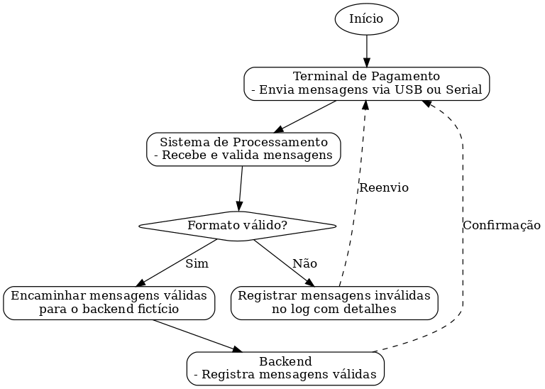

# PaymentTerminal Test - D&D Tech Group

## 📋 Sobre o Projeto
**PaymentTerminal** é uma aplicação desenvolvida em C++ que simula o funcionamento de um terminal de pagamento, desde a leitura de mensagens até o processamento e armazenamento de dados. O projeto foca na abstração do hardware e no tratamento eficiente das mensagens recebidas.

---

## 🔄 Fluxograma da Aplicação


---

## 📄 Estrutura do Projeto
```
PaymentTerminal/
├── PaymentTerminal/        # Simulação do terminal de pagamento
├── HAL/                    # Camada de abstração de hardware
├── MessageProcessor/       # Processamento e validação de mensagens
├── Backend/                # Armazenamento de mensagens processadas
└── Logger/                 # Sistema de geração de logs
```

### 🖥️ **PaymentTerminal**
- Simula um terminal de pagamento (Card Reader).
- Realiza a leitura de um arquivo de texto que simula a fila de mensagens enviada pelo hardware.
- Repassa cada mensagem lida para a classe **MessageProcessor** para o processamento.

---

### ⚙️ **HAL - Hardware Abstraction Layer** *(TODO)*
- Responsável por intermediar a comunicação com o hardware, compreender as diferenças entre os tipos de conexões, entender as similaridades entre os fabricantes dos card readers, converter para uma única linguagem padrão na qual será repassada para aplicação principal onde ela saberá se portar com as demais funcionalidades para seguir com o processamento da transação.

- 📥 **Entrada**: Mensagens recebidas do terminal de pagamento via diferentes conexões (USB, Serial, etc.).
- 📤 **Saída**: Mensagens convertidas para uma linguagem padrão compreensível pela aplicação principal.
- Trata diferenças entre fabricantes e padroniza a comunicação entre hardware e software.

---

### 🛠️ **MessageProcessor**
- **Funções principais**:
  - Receber e processar mensagens do terminal de pagamento.
  - Validar mensagens conforme um formato pré-definido (header).
  - Encaminhar mensagens válidas ao **Backend**.
  - Registrar mensagens inválidas no arquivo de log **logger.txt**.

---

### 📂 **Backend**
- Recebe e armazena mensagens válidas.
- As mensagens processadas são armazenadas em um arquivo chamado **queueBackend.txt**, simulando a fila de processamento e resposta da aplicação.

---

### 📝 **Logger**
- Classe utilitária para geração de logs durante o processamento da aplicação.
- Os logs são gravados no arquivo **logger.txt**.
- Registra erros, mensagens inválidas e outros eventos relevantes da execução.

---

## 🚀 Tecnologias Utilizadas
- **Linguagem**: C++
- **Paradigma**: Programação Orientada a Objetos (POO)
- **Padrões de Projeto**: SOLID

---

## 🛠️ Como Executar 

🪟 **Windows** ⚙️

**Pré Pronto**
1. Execute o **PaymentTerminal.exe** encontrado no diretório \PaymentTerminal\test
2. Irá ser executado com base no arquivo de entrada **paymentTerminal.txt**, encontrado no mesmo diretório.

**Do zero**
1. Compile o projeto utilizando um ambiente compatível (ex.: Visual Studio).
2. Configure o arquivo de entrada com as mensagens simuladas **paymentTerminal.txt** no mesmo diretório do **.exe** compilado,
3. Execute a aplicação e acompanhe os resultados:
   - Mensagens válidas em **queueBackend.txt**.
   - Logs em **logger.txt**.

⚙️ **Linux** 🐧

Em breve

---

